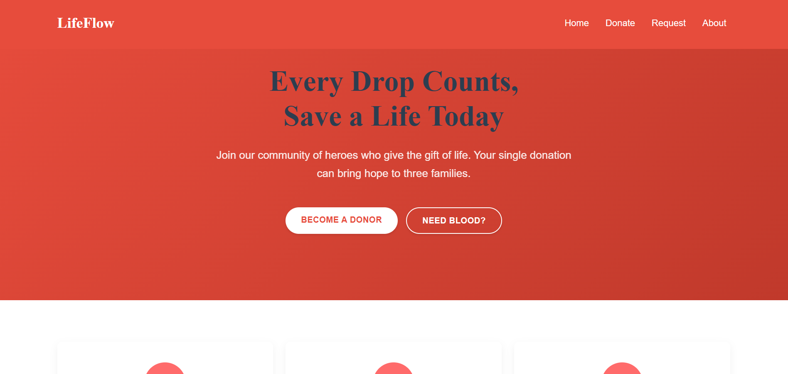
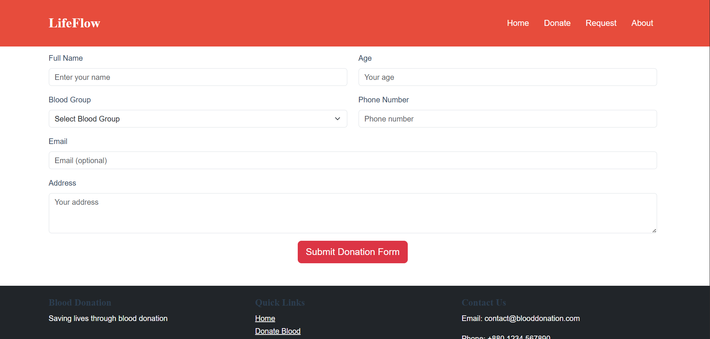
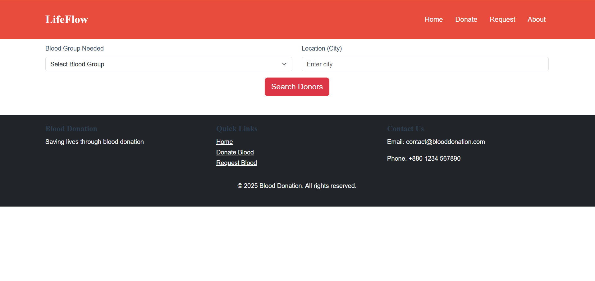
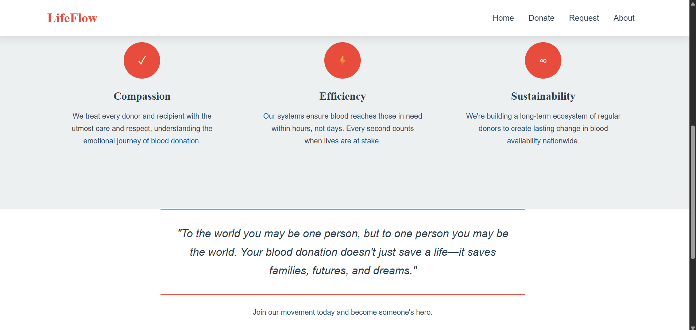

# 🩸 BloodBridge - Donation Platform


> A  blood donation management system built with React Vite

## ✨ Key Features
- Donor registration with validation
- Real-time blood request tracking
- Admin dashboard
- Responsive mobile-first design
- Secure data handling

## 🛠️ Tech Stack
| Category        | Technologies                 |
|-----------------|------------------------------|
| Framework       | React 18                     |
| Build Tool      | Vite                         |
| Styling         | Bootstrap 5.3.6 + Custom CSS |
| Routing         | React Router 6               |
| UI Components   | React Bootstrap              |

## 🎨 Design Team
<div align="center">

| Designer | ID | E-mail |
|----------|----|------|
|**Md. Shoaib** | 21701032 |shoaibcsecu@gmail.com|
|**Kazi Naiyem Hasan** | 21701010 | kazinaiyemcsecu@gmail.com |

</div>

</div>

## 📂 Project Structure
```bash
src/
├── components/           # Reusable components
│   ├── donor/            # Donor-related
│   ├── request/          # Blood request
│   └── ui/               # Generic UI
├── contexts/             # State management
├── hooks/                # Custom hooks
├── pages/                # Application views
├── styles/               # SCSS styles
├── utils/                # Helper functions
└── assets/               # Static assets
  
```
## 📸 Screenshots

<table align="center">
  <tr>
    <td align="center">
      <br/>
      🏠 <strong>Home Page</strong><br/>
      Shows a welcome message and latest blood requests.
    </td>
    <td align="center">
      <br/>
      🩸 <strong>Donate Page</strong><br/>
      Donors can register and submit donation info.
    </td>
  </tr>
  <tr>
    <td align="center">
      <br/>
      📥 <strong>Request Page</strong><br/>
      Users can request blood and see request status.
    </td>
    <td align="center">
      <br/>
      ℹ️ <strong>About Page</strong><br/>
      Information about the platform and mission.
    </td>
  </tr>
</table>


## 🚀 Quick Start
```bash
# Clone repository
git clone https://github.com/yourrepo/bloodbridge.git

# Install dependencies
npm install

# Start development server
npm run dev
```

